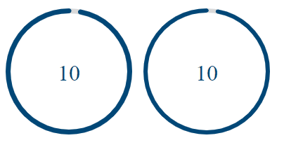

# Angular circle countdown (NgCircleCountdown)

[](https://travis-ci.org/jlevot/ng-circle-countdown) [](https://badge.fury.io/js/ng-circle-countdown) [](https://www.npmjs.com/package/ng-circle-countdown)

An Angular package for displaying a circle countdown fully configurable.



**Compatibility:**

| Angular | Angular |
|---------|---------|
| 16.x.x  | 1.0.3   |
| 17.x.x  | 2.0.0   |
| 18.x.x  | 3.0.0   |

## Installation

### Install This Library

`$ npm install ng-circle-countdown --save`

### Install This Library

To prevent timer from tab throttling, install the peer dependancy [worker-timers](https://github.com/chrisguttandin/worker-timers) :

`$ npm install worker-timers --save`

## Usage

### Import

Add `CircleCountdownModule` to your module file:

```javascript
imports: [CircleCountdownModule];
```

You can use it by this way:

```html

<div class="counter-container">
    <ng-circle-countdown
        #timer_color
        [duration]="10000"
        [colors]="[ '#004777', '#F7B801', '#A30000', '#A30000' ]"
        [colorsTime]="[ 7, 5, 2, 0 ]">
        <ng-template #counter let-counter>
            <span class="remaining-time" [style.color]="counter.color">{{counter.value}}</span>
        </ng-template>
    </ng-circle-countdown>
</div>
```

To catch the onComplete countDown event, you have to import the `CountdownService` and use a `compute` on the `isCompleted` property:

```html
public isCompleted: Signal
<boolean> = computed(() => this.countDown().isCompleted);
```

You can choose to use a formControl or just a formControlName. It depends on your needs.

## Options

| Options     | Type            | Default     | Description                                                                       |
|-------------|-----------------|-------------|-----------------------------------------------------------------------------------|
| duration    | `number`        | `0`         | Countdown duration (in ms)                                                        |
| color       | `string`        | `#004777`   | Primary color for the countdown displaying                                        |
| colors      | `<string>[]`    | `[]`        | Colors (HEX format) for the countdown displaying if you want to insert a gradient |
| colorsTime  | `number[]`      | `[]`        | Time interval(in s) to determine when the countdown should change color           |
| strokeWidth | `number`        | `6`         | Line thickness countdown                                                          |
| size        | `number`        | `None`      | Define the component size to match with your UI                                   |
| rotation    | `RotationType ` | `clockwise` | Direction of the countdown rotation                                               |

You can choose to set only one color to the countdown, so you just have to set the color property.

If you want to generate a gradient color, then set the colors array with the colors you want to display.
<br/>
You also have to set colorsTime array property to configure the color change moment.
